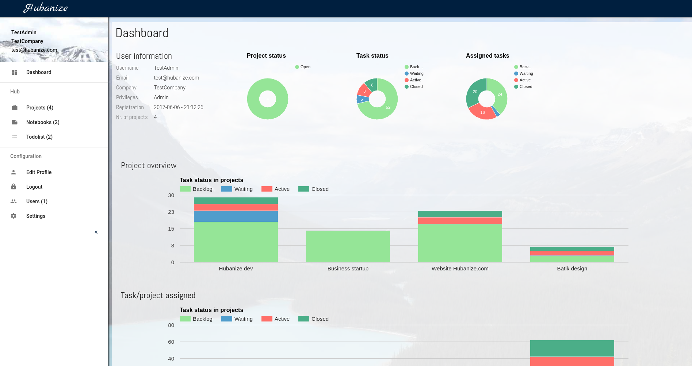
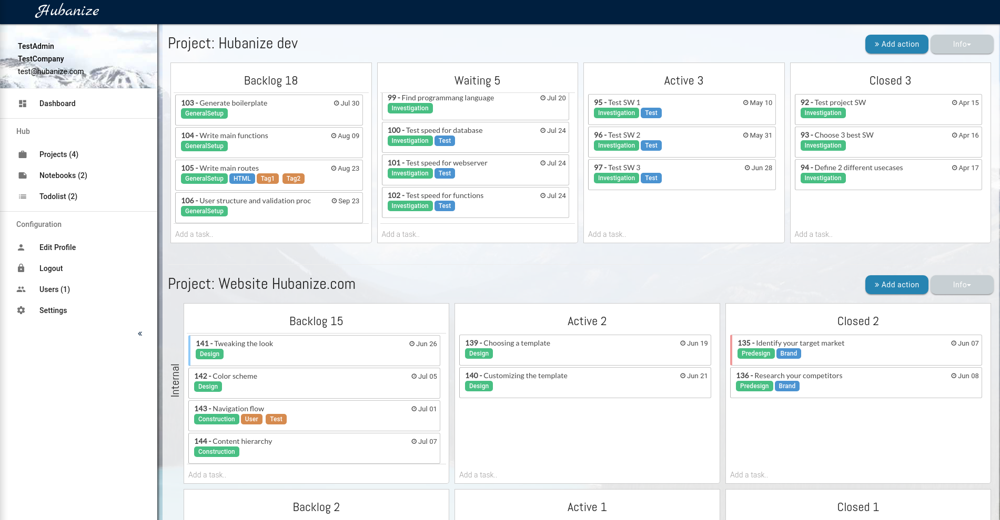
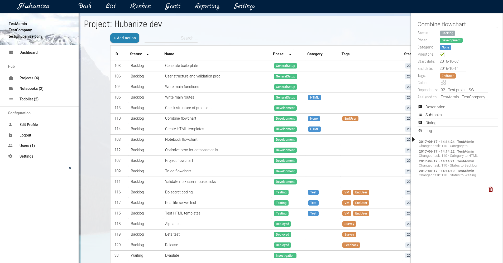
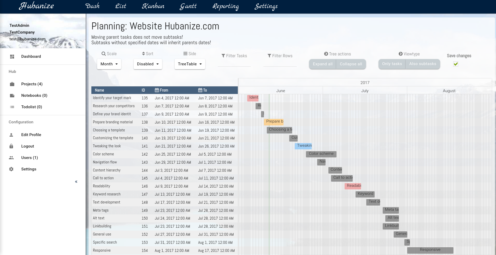
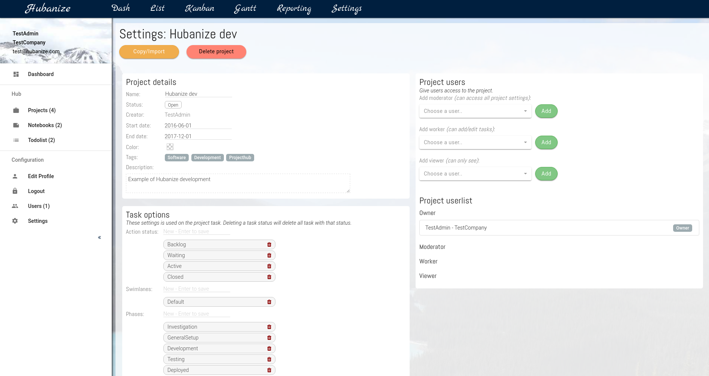
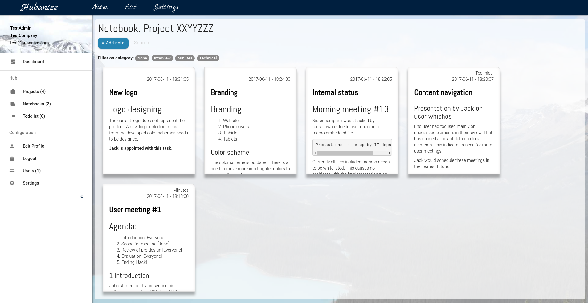
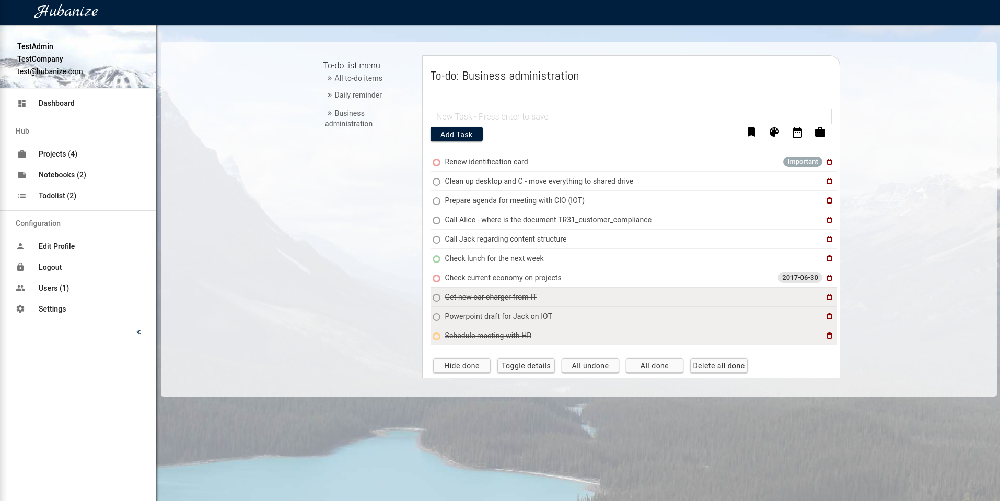

# Hubanize

Project management software combined with personal to-do lists and notebooks.

Alpha: https://ytd.dk

Beta: https://hubanize.com (not yet)

## Screenshots

### Dashboard

### Kanban

### Task in list view

### Gantt

### Project settings

### Notebook (notes)

### To-do list

## Features
**Hubanize** is primary designed for managing multiple projects at the same time. But it does contain multiple other features to enhance each users daily work. This is done by including personal (or project specific) to-do lists and notebooks  for e.g. minute of meeting.
The reason for **Hubanize's** splitted focus *(project specific and user specific)* is to ensure, that all tasks  relating to the projects and the users personal daily tasks are collected into one single tool.

The design focuses on simplicity with all the features and functions no more than 2 mouse-clicks away.

### Projects
Projects can be accessed in the main sidebar on the left. When the sidebar is folded out, a *project-menu* is available with the following options:

 1. View all projects in a list form
 2. Add a new project
 3. View a single existing project

#### View all projects in a list form
When choosing this option, all the projects you have privileges to see, will be shown in a list form.

#### Add a new project
This page gives you the ability to add a new project, if you have sufficient privileges.

It is only required to define a project name.

#### View a single existing project
This will redirect you to the projects dashboard. A single project consists of:

 1. Dashboard - overview of the project
 2. List - a list view of all tasks
 3. Kanban - a kanban view of all the tasks
 4. Gantt - a Gantt (time schedule) of all the tasks
 5. Notes - all notes with a reference to this project
 6. Reporting - a economy reporting page
 6. Settings - if you have the sufficient privileges this option is shown

##### Tasks
The main driver in the projects are the tasks. A task does only require a name, all other data is optional. The other data includes:

 - Status
 - Swimlane
 - Phase
 - Category
 - Tags
 - Start date
 - End date
 - Description
 - Assigned to
 - Dependency before
 - Color
 - Subtasks

### Notebooks
Notebooks can be accessed in the main sidebar on the left. When the sidebar is folded out, a *notebook-menu* is available with the following options:

 1. View all notebooks in a list form
 2. Add a new notebook
 3. View a single existing notebook

A notebook contains notes. Notes is defined as single page notes with full editability.

#### View all notebooks in a list form
When choosing this option, all the notebooks you have the right to see, will be shown in a list form.

#### Add a new notebook
This page gives you the ability to add a new notebook, if you have sufficient privileges.

It is only required to define a project name.

#### View a single existing notebook
This will redirect you to the notebook. All the notes within this notebook will be shown to you.

It is possible to search within a notebook.

### To-do lists
To-do lists can be accessed in the main sidebar on the left. When the sidebar is folded out, a *to-do list-menu* is available with the following options:

 1. View all to-do lists in a list form
 2. View all to-do items
 3. View a single existing to-do list

A to-do list contains to-do items. A to-do item is defined as a single activity with a small amount of optional data.

#### View all to-do items
When choosing this option, all the to-do items you have the right to see, will be shown.

#### View a single existing to-do list
When choosing this option, all the to-do items you have the right to see, will be shown.

#### View a single existing notebook
This will redirect you to the to-do list. All the to-do items within this to-do list will be shown to you.

### Users

Hubanize i built upon 4 main level roles: AdminHV, Admin, Moderator, User. Each level with individual privileges and restrictions.

User management is made easy with a tree structured user status. All actions performed by the user is verified before it is executed.

#### User levels

The user status is divided into 3 main groups.

##### _AdminHV_

AdminHV is only accessible if you host Hubanize by you self.

##### _Admin_

The admin has full control of **Hubanize** and has the ability to do everything. This includes deleting projects, which are created by others. This is the master user, and should only be used for major maintenance.

##### _Moderator_

The moderator is the admins right hand. The moderator can create new projects and has access to the user management. The moderator cannot see or delete other moderators or admins projects. The moderator cannot delete a admin user. The moderator account should be used by the person(s), who is responsible for the daily usage and management.

##### _User_

This is a normal account. The user has only 'See' privileges and can only see projects which they are added to. The users privileges can be scaled up on individual projects (see 'Project roles' below).

#### Project levels

A moderator can add users of all user levels to a project if the moderator is the owner of the project. When adding a user to a project, the users **Project role** needs to be defined. There are 3 Project roles: Moderator, Worker, Viewer.

##### _Moderator_

Can do everything inside the project - even though if the user has a User level: User. The access includes Project settings and Project reporting.

##### _Worker_

Can add and edit within the project. This is the Project role is for the persons working on the project. This role can access and work with the tasks, but not access the project settings.

##### _Viewer_

Can only see. The viewer is an observer-account with limited access.
